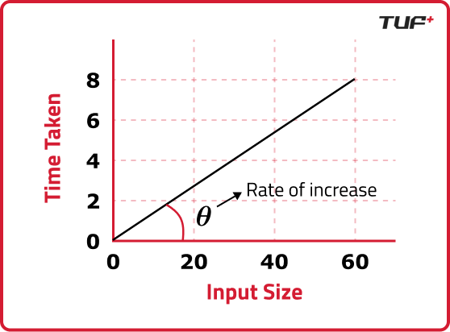

# ⏱️ Time & Space Complexity: The Ultimate Guide

In computer science, we don't measure algorithm speed in *seconds* (because that depends on your hardware). We measure it in **growth steps**.


 
**Key Question:** "If I increase the input size ($N$), how many more operations does the code perform?"

---
## Cheat Sheet: Constraints Analysis
In competitive programming (like LeetCode), the input size ($N$) gives you a hint about the required Time Complexity.

| Input Size ($N$) | Allowed Complexity | Typical Algorithm |
| :--- | :--- | :--- |
| **$N \le 10$** | $O(N!)$ or $O(2^N)$ | Backtracking, Recursion |
| **$N \le 100$** | $O(N^3)$ | Floyd-Warshall |
| **$N \le 2,000$** | $O(N^2)$ | Nested Loops, Bubble/Insertion Sort |
| **$N \le 10^5$ or $10^6$** | $O(N)$ or $O(N \log N)$ | Merge Sort, Hash Maps, Two Pointers |
| **$N \le 10^9$** | $O(\log N)$ or $O(1)$ | Binary Search, Math Formula |

> **Rule of Thumb:** Most coding platforms allow $\approx 10^8$ operations per second. If your logic exceeds this count based on $N$, you will get "Time Limit Exceeded" (TLE).
---

## 1. Understanding Notations

* **Best Case ($\Omega$ - Omega):** If you get lucky (e.g., finding the item in the first slot).
* **Average Case ($\Theta$ - Theta):** The expected performance.
* **Worst Case ($O$ - Big O):** If everything goes wrong (e.g., finding the item in the last slot). **This is what we care about in interviews.**
    - Big O describes the **Worst-Case Scenario** (Upper Bound). It tells you the maximum amount of time or space an algorithm might require.

---

## 2. The Complexity Hierarchy (Fastest to Slowest)

| Notation | Name | Analogy | Code / Logic Pattern |
| :--- | :--- | :--- | :--- |
| **$O(1)$** | **Constant** | Instant access. | `int x = arr[0];` <br> `if (n % 2 == 0)` |
| **$O(\log N)$** | **Logarithmic** | Halving the input repeatedly. | `while(n > 0) n /= 2;` <br> `for(i=1; i<n; i*=2)` |
| **$O(N)$** | **Linear** | Reading page by page. | `for(int i=0; i<n; i++)` |
| **$O(N \log N)$** | **Linearithmic**| Sorting a deck of cards. | `std::sort(arr.begin(), arr.end())` <br> `MergeSort(arr)` |
| **$O(N^2)$** | **Quadratic** | Comparing everyone to everyone. | `for(i=0; i<n; i++)` <br> &nbsp;&nbsp;`for(j=0; j<n; j++)` |
| **$O(2^N)$** | **Exponential** | Recursion tree explosion. | `return fib(n-1) + fib(n-2);` |
| **$O(N!)$** | **Factorial** | Trying every permutation. | `void permute(String s) { ... }` |

---

## 3. How to Calculate Time Complexity

### Rule 1: Drop the Constants
We care about growth, not specifics.
* $2N \rightarrow O(N)$
* $500N + 5 \rightarrow O(N)$
* $N^2 + 100N \rightarrow O(N^2)$ (Keep the dominant term)

### Rule 2: Loops
A simple loop running $N$ times is $O(N)$.

```cpp
// O(N)
for (int i = 0; i < n; i++) {
    cout << i;
}
```

### Rule 3: Nested Loops
Multiply the complexity of the outer and inner loops.

```cpp
// O(N * N) = O(N^2)
for (int i = 0; i < n; i++) {
    for (int j = 0; j < n; j++) {
        cout << i << j;
    }
}
```

### Rule 4: Sequential Statements
Add the complexities.

```cpp
// Loop 1: O(N)
for (int i = 0; i < n; i++) { ... }

// Loop 2: O(N)
for (int j = 0; j < n; j++) { ... }

// Total: O(N) + O(N) = O(2N) -> O(N)
```

### Rule 5: Logarithmic Logic
If the loop variable is **multiplied** or **divided** instead of incremented, it is usually $O(\log N)$.

```cpp
// i becomes: 1, 2, 4, 8, 16...
// This reaches N in log2(N) steps.
for (int i = 1; i < n; i = i * 2) {
    cout << i;
}
```

---

## 4. Space Complexity: Memory Usage

This measures how much **extra memory** (RAM) your algorithm needs to solve the problem.

### Key Distinction: Input vs. Auxiliary Space
* **Input Space:** Space taken by the input itself (e.g., an array of size $N$). Usually, we **ignore** this when asked for "Space Complexity".
* **Auxiliary Space:** The *extra* space you create (variables, hash maps, new arrays). **This is what interviews ask for.**

### Examples

**1. $O(1)$ Space (Constant)**
Using a few variables (`i`, `j`, `k`, `sum`), regardless of input size.
```cpp
int sum = 0;
for(int x : arr) sum += x; // Only 'sum' is stored.
```

**2. $O(N)$ Space (Linear)**
Creating a new data structure proportional to the input.
```cpp
vector<int> copy;
for(int x : arr) copy.push_back(x); // 'copy' grows with N.
```

**3. $O(N)$ Recursion Stack**
Recursive functions use memory! Each call adds a "frame" to the stack.
```cpp
void recursive(int n) {
    if (n == 0) return;
    recursive(n - 1); // Stack depth is N
}
```

---

