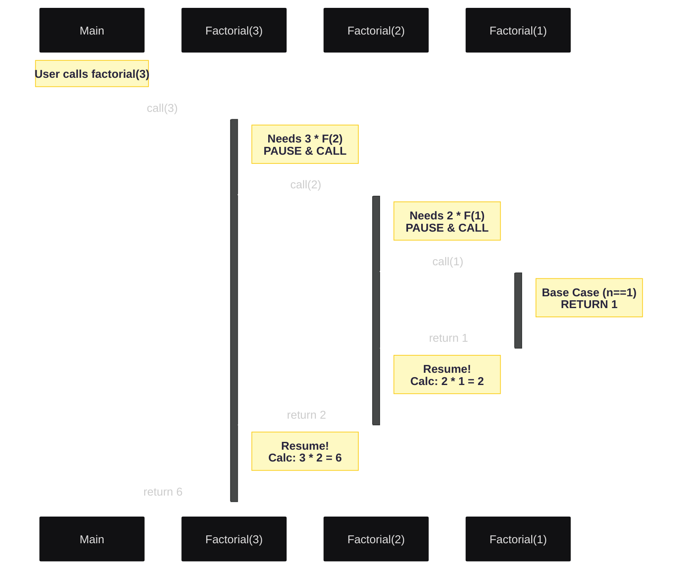
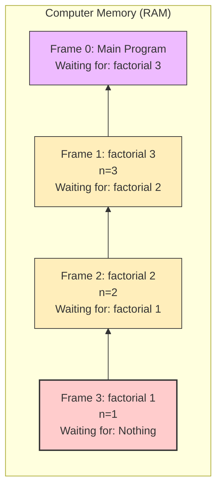
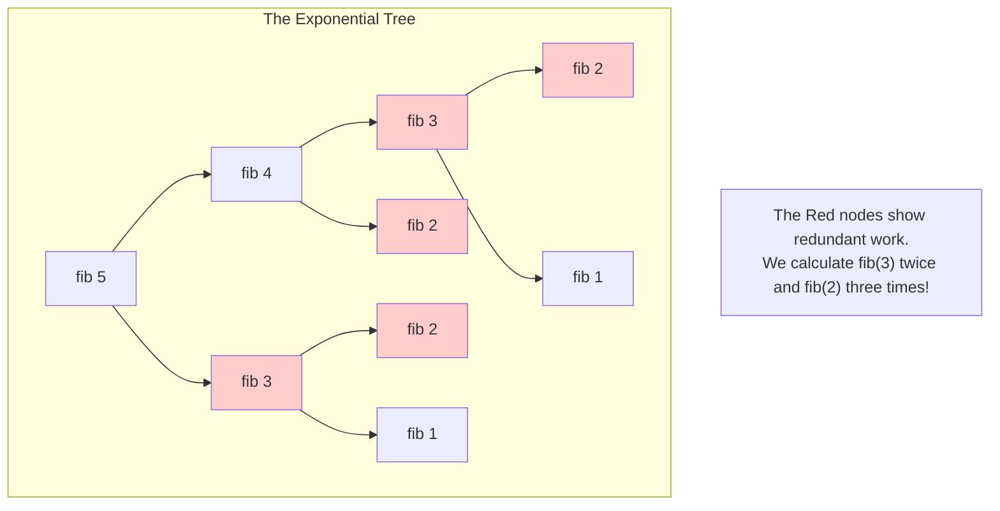
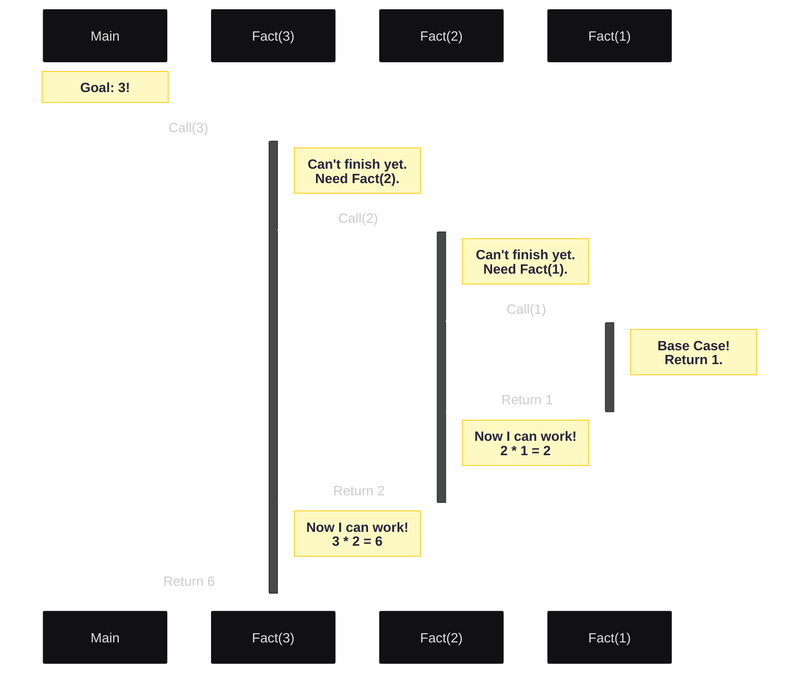
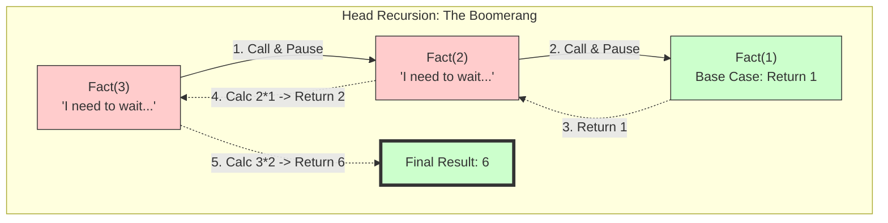
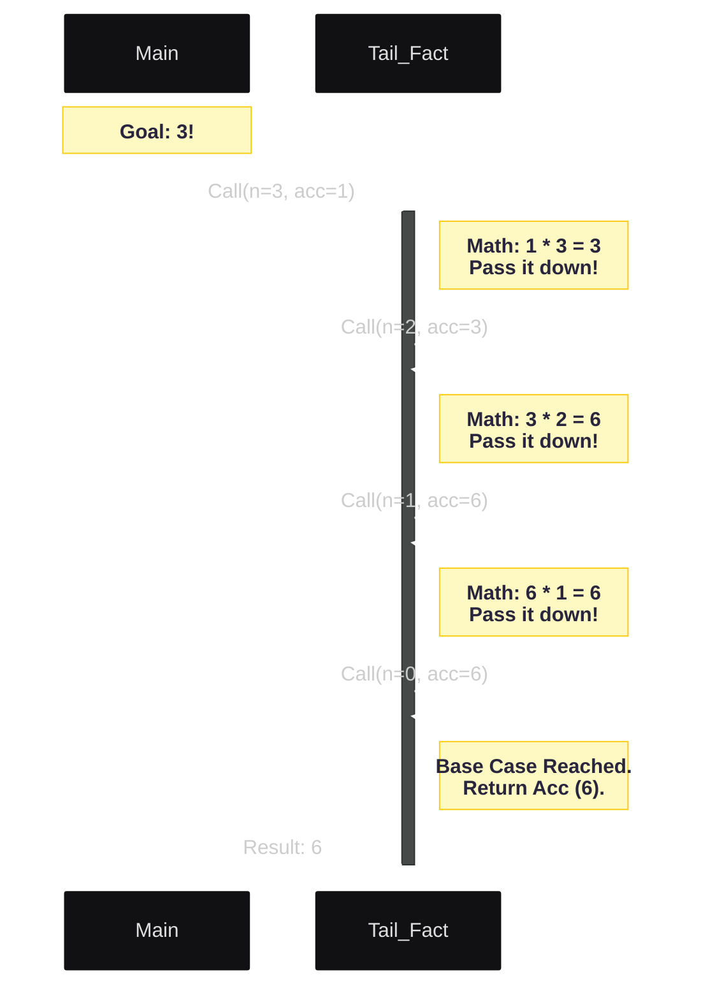
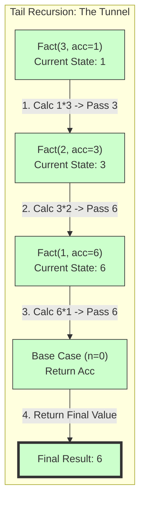
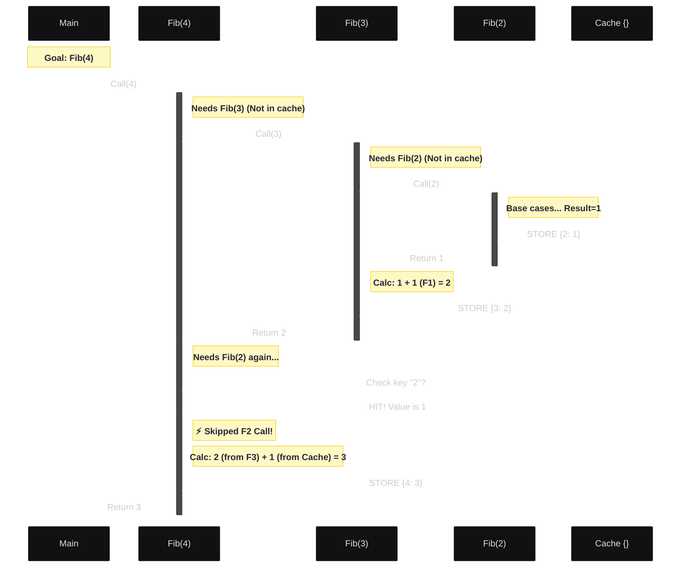
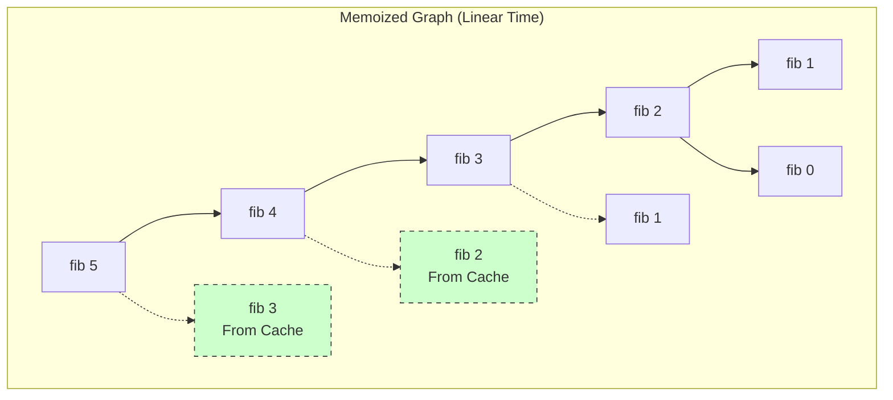
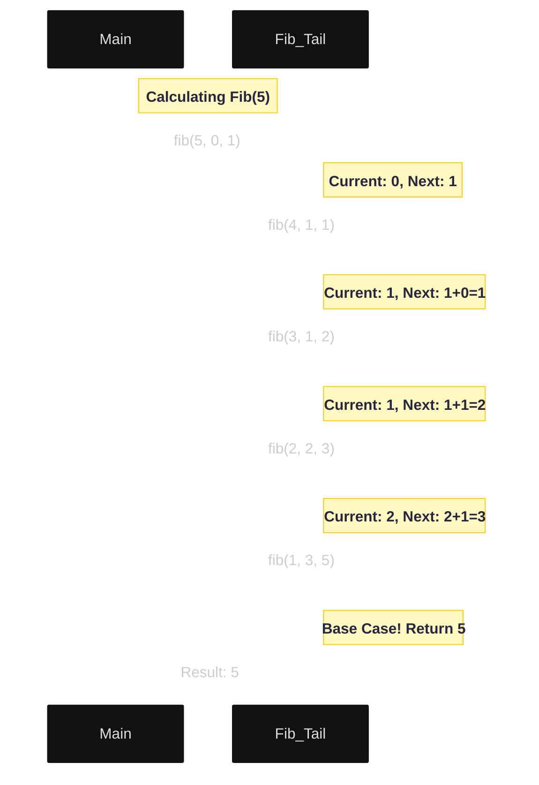

# Recursion
- Recursion is a programming technique where a function calls itself to solve smaller instances of the same problem.
- It is commonly used for problems that can be broken down into smaller, similar subproblems.
- A recursive function typically has two main components:
  1. Base Case: The condition under which the function stops calling itself to prevent infinite recursion.
  2. Recursive Case: The part of the function where it calls itself with a modified argument to work towards the base case.

### Example of a Recursive Function
Here is a simple example of a recursive function to calculate the factorial of a number:
#### Python
```python
def countdown(n):
    # 1. Base Case
    if n == 0:
        print("Blastoff!")
        return
    
    # 2. Recursive Step
    print(n)
    countdown(n - 1) 
```

#### C++
```cpp
void countdown(int n) {
    // 1. Base Case
    if (n == 0) {
        std::cout << "Blastoff!" << std::endl;
        return;
    }
    // 2. Recursive Step
    std::cout << n << std::endl;
    countdown(n - 1);
}
```
#### In this example, the function `factorial` calls itself with the argument `n - 1` until it reaches the base case of `n` being 0 or 1.
# Lesson 2: Under the Hood - The Call Stack (Visualized)
**Focus:** Memory Management & Execution Flow | **Example:** `factorial(3)`


## The Concept
When a function calls itself, the computer does not "restart" the function. It pauses the current version and creates a **brand new instance** of that function in memory.

This area of memory is called the **Call Stack**. It works like a stack of plates:
1.  **Push:** When a function is called, a new "plate" (Stack Frame) is added to the top.
2.  **Pop:** When a function returns, the top plate is removed, and we resume the one below it.

### 🖼️ Mermaid Diagram 1: The Execution Flow
This Sequence Diagram shows exactly how the computer "pauses" execution.
* **Solid lines (`->`)** represent the "Winding" phase (Calling).
* **Dotted lines (`-->`)** represent the "Unwinding" phase (Returning).
* *Notice how `factorial(3)` stays alive (active bar) the entire time!*



### 🖼️ Mermaid Diagram 2: The Memory Snapshot
This diagram represents the computer's RAM at the **deepest moment** of recursion (just before the base case returns).

* This is why recursion uses **O(N) Memory**.
* If this stack gets too high (e.g., `factorial(10000)`), you run out of RAM = **Stack Overflow**.



## Lesson 3: Recursion vs Iteration

| Feature | Recursion | Iteration (Loops) |
| :--- | :--- | :--- |
| **Readability** | High (often fewer lines) | Moderate (can get messy) |
| **State** | Implicit (managed by Stack) | Explicit (managed by counters) |
| **Memory Usage** | High (O(N) stack space) | Low (O(1) usually) |
| **Performance** | Slower (function overhead) | Faster (CPU optimized) |

 **Rule of Thumb: Use recursion for `trees, graphs, and hierarchical data`. Use iteration for simple `lists or counters`.**


## Lesson 4: Types of Recursion & Optimization Strategies

## Part I: The Types of Recursion (The Shapes)

Recursion comes in three primary "shapes," defined by **where** and **how often** the recursive call happens.

### 1. Naive/Tree Recursion (The "Explosion")
**Definition:** A function is "Tree Recursive" if it makes **more than one** recursive call inside a single step.

**Example:** The naive Fibonacci sequence (`fib(n) = fib(n-1) + fib(n-2)`).
* **The Shape:** It does not form a straight line. It splits into branches.
* **The Cost:** It grows exponentially ($O(2^n)$). Every step doubles the work.

#### The Code (Naive Approach)
```python
def fib(n):
    if n <= 1: return n
    return fib(n - 1) + fib(n - 2)
```

#### 🖼️ Mermaid Diagram: The Explosion
*Notice how `fib(2)` and `fib(3)` appear multiple times. We are doing the same work over and over!*



---

### 2. Head Recursion (The Boomerang / Stack Build-up)
* **Definition:** The recursive call is made **before** the actual work is done.
* **Flow:** Dive down -> Hit Base Case -> Calculate on the way up.
* **Memory:** High. Stack frames must stay open to perform the multiplication later.


**Head Recursion (Call First):**
```python
def factorial_head(n):
    # Base Case
    if n == 0: 
        return 1
    
    # Recursive Step (Head)
    # We cannot return yet! We must wait for the result of factorial_head(n-1)
    # and THEN multiply it by n.
    result = factorial_head(n - 1)
    return n * result
```

#### 🖼️ Mermaid Diagram: The "Boomerang" Flow
*Notice how nothing is printed during the "Call" phase. All the printing happens during the "Return" phase.*



#### 🖼️ Mermaid Diagram: The "Boomerang" Graph



### 3. Tail Recursion (The Tunnel / Accumulator)
* **Definition:** The recursive call is the **absolute last action** of the function.
* **Flow:** Calculate -> Pass Result -> Dive down.
* **Memory:** Low (Potential $O(1)$). The parent has no work left, so the compiler can close the stack frame.

#### The Code (Accumulator Style)
We pass the state (`a`, `b`) *down* the chain. The function never needs to "wait" for a return value to do more math.

```python
def factorial_tail(n, accumulator=1):
    # Base Case: Return the specific answer we built
    if n == 0: 
        return accumulator
    
    # Tail Recursive Step
    # We do the math (accumulator * n) NOW.
    # Then we pass the result down. No waiting!
    return factorial_tail(n - 1, accumulator * n)
```

#### 🖼️ Mermaid Diagram: The "Tunnel" Flow

*Notice how each call does its work immediately and passes the result down. There is no waiting!*



#### mermaid Diagram: The "Tunnel" Graph



  
 
## Part II: Optimization Strategies (The Fixes)

We apply specific optimizations to specific problems.

### Optimization I: Memoization (Fixing Tree Recursion)

- **The Problem:** Tree Recursion recalculates the same sub-problems (e.g., `fib(3)`) multiple times.
- **The Fix:** **Cache** the result the first time we see it.
- **Result:** Transforms the Tree into a **Directed Acyclic Graph (DAG)**. Complexity drops from $O(2^n)$ to $O(N)$.

#### The Code (Memoized)
```python
memo = {}

def fib_memo(n):
    if n <= 1: return n
    
    # 1. Check Cache
    if n in memo:
        return memo[n]
    
    # 2. Calculate and Cache
    result = fib_memo(n - 1) + fib_memo(n - 2)
    memo[n] = result
    return result
```

#### 🖼️ Sequence Diagram: The Cache Hit
*Watch the "Right Branch" skip the work because the "Left Branch" already did it.*



#### 🖼️ Graph Diagram: The Lean DAG
*The dashed lines show where we reuse existing answers.*



---

### Optimization II: Tail Call Optimization (Fixing Space)

- **The Problem:** Standard recursion (Head or Tree) keeps Stack Frames open waiting for children to return. `fib(10000)` causes **Stack Overflow**.
- **The Fix:** **Tail Recursion**. Since the parent has no work left to do, the compiler can safely "delete" the parent's stack frame before jumping to the child.
- **Result:** Space Complexity drops from $O(N)$ to $O(1)$.

#### The Code (Tail Recursive Fibonacci)
```python
def fib_tail(n, a=0, b=1):
    # Base Case
    if n == 0:
        return a
    # Tail Recursive Step
    return fib_tail(n - 1, b, a + b)
```

#### 🖼️ Sequence Diagram: The Flat Chain
*Notice there is no unwinding. The `Result: 5` is just passed along.*



---

## Summary Matrix

| Strategy | Shape | Time Complexity | Space Complexity | Best For |
| :--- | :--- | :--- | :--- | :--- |
| **Naive / Tree** | Exploding Pyramid | $O(2^n)$ (Horrible) | $O(N)$ | Understanding logic |
| **Memoization** | Pruned Graph (DAG) | $O(N)$ (Fast) | $O(N)$ | Dynamic Programming |
| **Tail Rec** | Flat Tunnel | $O(N)$ (Fast) | $O(1)$* | Production Systems (Loops) |

*\*O(1) space assumes the compiler supports Tail Call Optimization (like C++, Scala, Haskell). Python does not support this naturally.*

For more details about the head and tail use case, refer to [Parameterized Recursion.](https://takeuforward.org/plus/dsa/problems/recursion-concepts-with-parameters?category=beginner-problem&subcategory=basic-recursion)