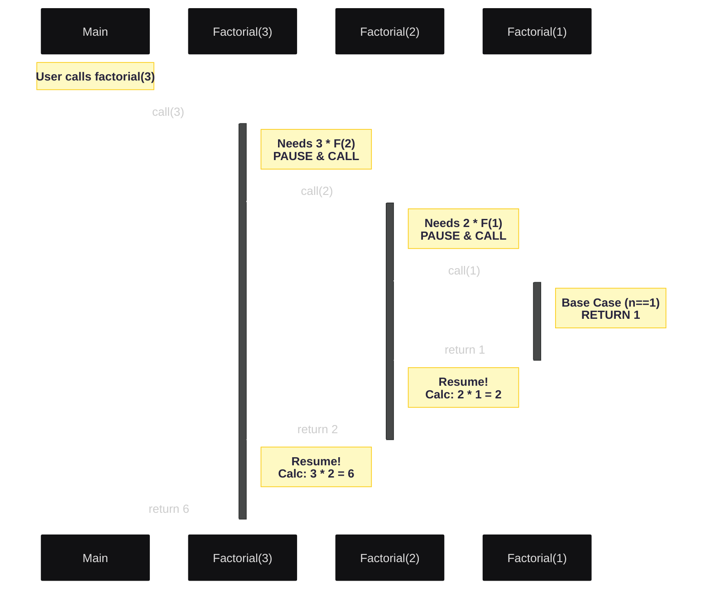
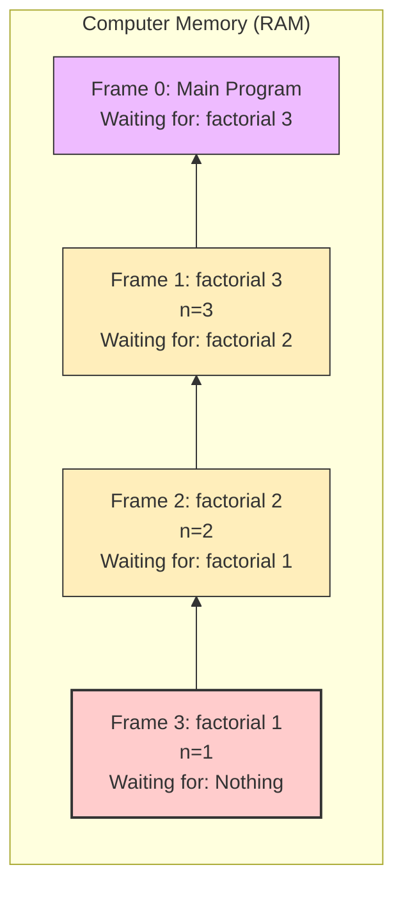
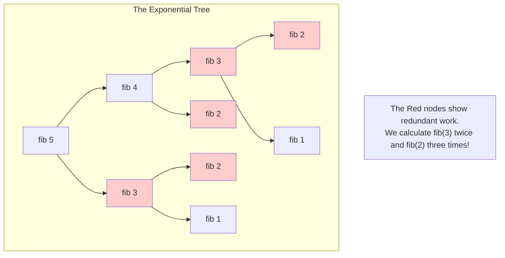
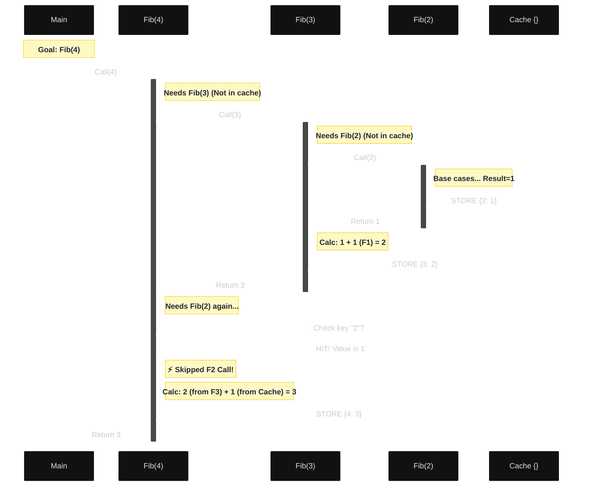
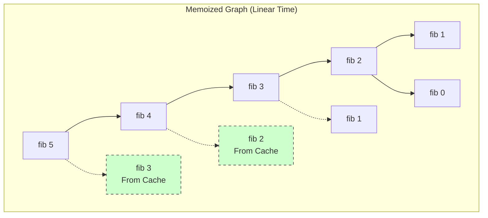
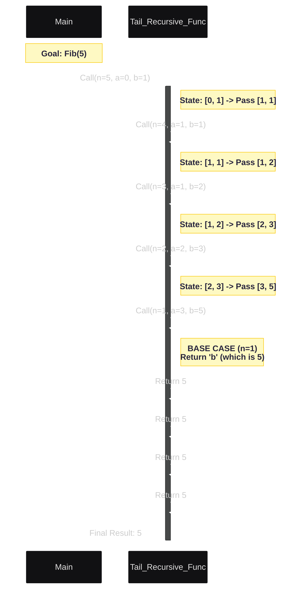
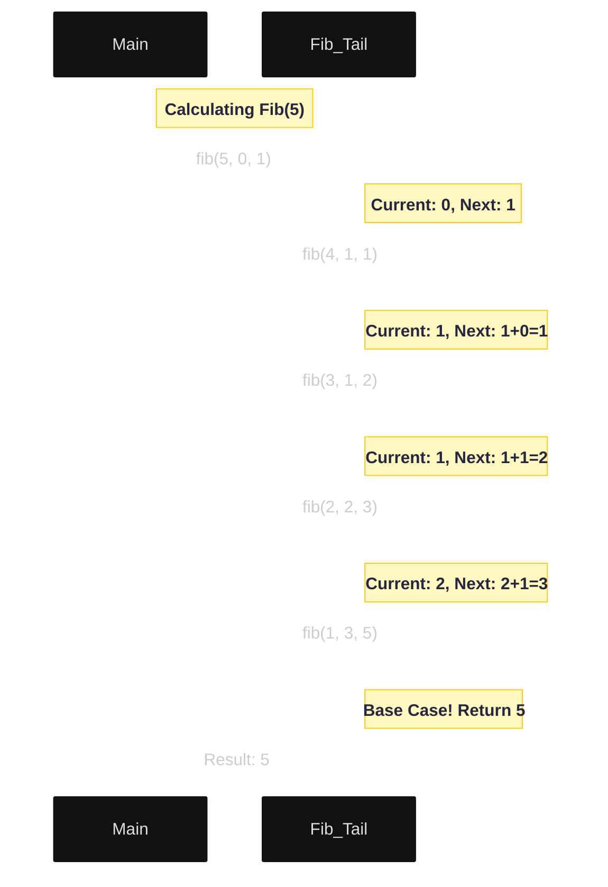
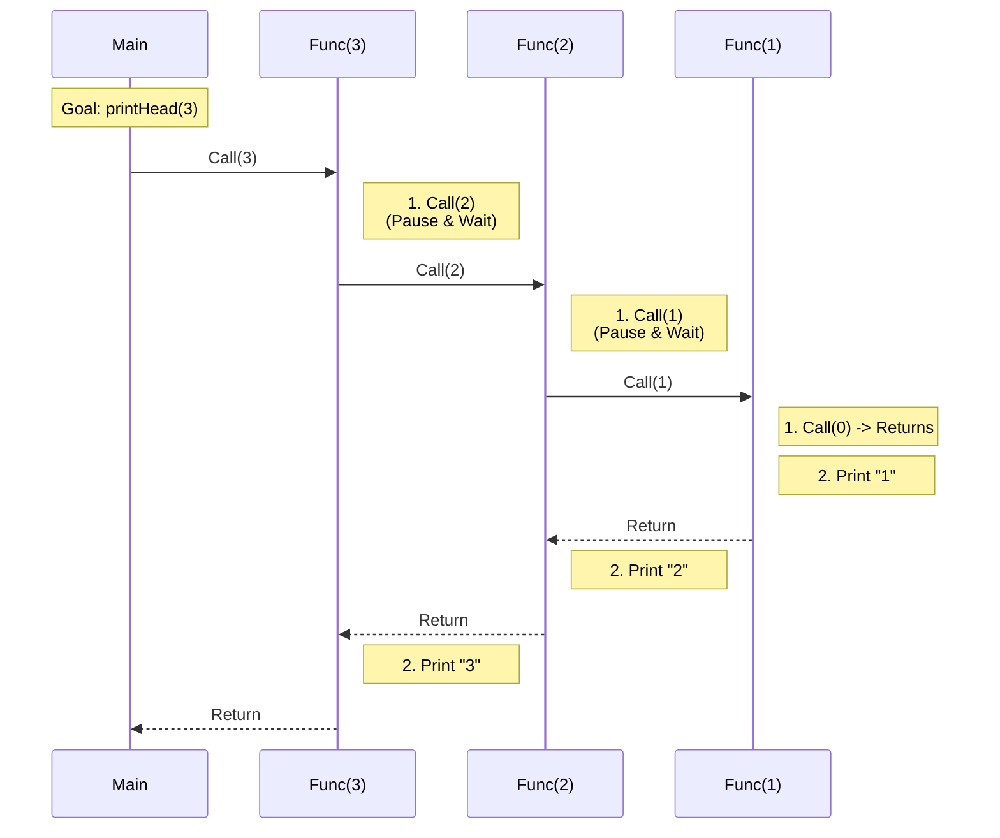

# Recursion
- Recursion is a programming technique where a function calls itself to solve smaller instances of the same problem.
- It is commonly used for problems that can be broken down into smaller, similar subproblems.
- A recursive function typically has two main components:
  1. Base Case: The condition under which the function stops calling itself to prevent infinite recursion.
  2. Recursive Case: The part of the function where it calls itself with a modified argument to work towards the base case.

### Example of a Recursive Function
Here is a simple example of a recursive function to calculate the factorial of a number:
#### Python
```python
def countdown(n):
    # 1. Base Case
    if n == 0:
        print("Blastoff!")
        return
    
    # 2. Recursive Step
    print(n)
    countdown(n - 1) 
```

#### C++
```cpp
void countdown(int n) {
    // 1. Base Case
    if (n == 0) {
        std::cout << "Blastoff!" << std::endl;
        return;
    }
    // 2. Recursive Step
    std::cout << n << std::endl;
    countdown(n - 1);
}
```
#### In this example, the function `factorial` calls itself with the argument `n - 1` until it reaches the base case of `n` being 0 or 1.
# Lesson 2: Under the Hood - The Call Stack (Visualized)
**Focus:** Memory Management & Execution Flow | **Example:** `factorial(3)`

---

## The Concept
When a function calls itself, the computer does not "restart" the function. It pauses the current version and creates a **brand new instance** of that function in memory.

This area of memory is called the **Call Stack**. It works like a stack of plates:
1.  **Push:** When a function is called, a new "plate" (Stack Frame) is added to the top.
2.  **Pop:** When a function returns, the top plate is removed, and we resume the one below it.

---

### 🖼️ Mermaid Diagram 1: The Execution Flow
This Sequence Diagram shows exactly how the computer "pauses" execution.
* **Solid lines (`->`)** represent the "Winding" phase (Calling).
* **Dotted lines (`-->`)** represent the "Unwinding" phase (Returning).
* *Notice how `factorial(3)` stays alive (active bar) the entire time!*



---

### 🖼️ Mermaid Diagram 2: The Memory Snapshot
This diagram represents the computer's RAM at the **deepest moment** of recursion (just before the base case returns).

* This is why recursion uses **O(N) Memory**.
* If this stack gets too high (e.g., `factorial(10000)`), you run out of RAM = **Stack Overflow**.



---
## Recursion vs Iteration

| Feature | Recursion | Iteration (Loops) |
| :--- | :--- | :--- |
| **Readability** | High (often fewer lines) | Moderate (can get messy) |
| **State** | Implicit (managed by Stack) | Explicit (managed by counters) |
| **Memory Usage** | High (O(N) stack space) | Low (O(1) usually) |
| **Performance** | Slower (function overhead) | Faster (CPU optimized) |

 **Rule of Thumb: Use recursion for `trees, graphs, and hierarchical data`. Use iteration for simple `lists or counters`.**

---

## Lesson 4: The Production Pattern (The Tree Problem)

When we write a naive recursive function for Fibonacci (`fib(n) = fib(n-1) + fib(n-2)`), we aren't creating a straight line of work. We are creating a **Tree**.

Every time you call `fib(5)`, it spawns two children: `fib(4)` and `fib(3)`. Those children spawn two more. This grows exponentially ($O(2^n)$).

### The Code (Naive Approach)
```python
def fib(n):
    if n <= 1: return n
    return fib(n - 1) + fib(n - 2)
```

### 🖼️ Mermaid Diagram: The Explosion
*Notice how `fib(2)` and `fib(3)` appear multiple times. We are doing the same work over and over!*



---

## Lesson 5: Optimization I - Memoization (Time) | 

**The Problem:** The tree above does redundant work.

**The Fix:** "Memoization" (The Reminder Note). Before we do a calculation, we check if we've already done it. If yes, we return the saved answer.

This turns the massive **Tree** into a lean **Directed Acyclic Graph (DAG)**.

### The Code (Memoized)
```python
memo = {}

def fib_memo(n):
    if n <= 1: return n
    
    # 1. Check Cache
    if n in memo:
        return memo[n]
    
    # 2. Calculate and Cache
    result = fib_memo(n - 1) + fib_memo(n - 2)
    memo[n] = result
    return result
```

Complexity Drops from $O(2^n)$ to $O(n)$ Time. Space remains $O(n)$ due to the memo dictionary and call stack.

### Sequence Diagram: Memoized Execution Flow


**Scenario:** We want `Fib(4)`.
* **Left Branch:** We have to do the hard work for `Fib(3)` and `Fib(2)`.
* **Right Branch:** When `Fib(4)` needs `Fib(2)` again, it finds it in the cache!

*Watch the "Cache" participant at the bottom to see data being stored.*



*Notice how the arrows merge. We calculate `fib(3)` once, and the second request just points to the existing result.*




---

## Lesson 6: Optimization II - Tail Recursion (Space)

**The Problem:** Even with Memoization, `fib(10000)` will crash because we still pile up 10,000 Stack Frames waiting for answers.

**The Fix:** **Tail Recursion**. Instead of waiting for the answer to bubble up, we pass the running total *down* into the next function call.

We change the shape from a **Pyramid** (Stack) to a **Tunnel** (Iterative-like).

### The Code (Tail Recursive / Accumulator)
We pass two accumulators: `a` (current) and `b` (next).
*Logic:* `fib(n, a, b)` becomes `fib(n-1, b, a+b)`

```cpp
// C++ (Compilers optimize this into a loop)
long long fib_tail(int n, long long a = 0, long long b = 1) {
    if (n == 0) return a;
    if (n == 1) return b;
    
    // Tail Call: The function returns the result of the NEXT call directly.
    // No calculation is performed *after* the return.
    return fib_tail(n - 1, b, a + b);
}
```
This reduces Space Complexity to $O(1)$ (constant space) if the compiler supports Tail Call Optimization.
### Sequence Diagram: Tail Recursion Flow
**Concept:** In standard recursion, the "Main" function waits for the "Helper" to return. In Tail Recursion, the "Main" function passes the *current answer* to the "Helper" and says, "I'm done. You finish it."

**Scenario:** Calculating `Fib(5)` using Accumulators.
* `a` = current number
* `b` = next number
* Notice there is no "calculation" happening on the return arrows (dotted lines). The answer is built on the way **down**, not the way **up**.




### 🖼️ Mermaid Diagram: The Flat Chain
*There is no tree. There is no unwinding. It is a single chain of state updates.*


# Lesson 7: Head Recursion (The "Boomerang" Effect)
**Focus:** execution Flow & Post-Processing | **Example:** Printing 1 to N

---

## The Concept
Most people write "Body Recursion" or "Tail Recursion" intuitively. **Head Recursion** is slightly different: the recursive call is made **before** the actual work is done.

* **Tail Recursion:** Do work -> Pass result to next clone. (Work happens on the way **Down/Winding**).
* **Head Recursion:** Call next clone -> Wait for them to return -> Do work. (Work happens on the way **Up/Unwinding**).

It acts like a **Boomerang**: You throw it out (recursive calls), it hits the base case, and then performs actions as it flies back to you.

### Use Cases
* Reversing a string or list.
* Post-order Tree Traversal (processing children before the parent).
* Solving dependency graphs.

---

### The Code Comparison

We want to print numbers from 1 to 5.

#### 1. Tail Recursion (The Normal Way)
*Prints **before** the call.*
```cpp
void printTail(int n) {
    if (n == 0) return;
    std::cout << n << " "; // Print 5
    printTail(n - 1);      // Call 4
}
// Output: 5 4 3 2 1
```

#### 2. Head Recursion (The Boomerang)
*Prints **after** the call returns.*
```cpp
void printHead(int n) {
    if (n == 0) return;
    printHead(n - 1);      // Call 4 (Wait...)
    std::cout << n << " "; // Print 5 (Happens last!)
}
// Output: 1 2 3 4 5
```

---

### 🖼️ Mermaid Diagram: The "Boomerang" Flow

This diagram visualizes `printHead(3)`. Notice how nothing is printed during the "Call" phase. All the printing happens during the "Return" phase.




---

### 🧠 Mental Model: The Stack as a Storage
In Head Recursion, the **Call Stack** implicitly stores your data for you.

If you input "A, B, C" into a head-recursive function, the stack holds them in memory as:
1.  Frame C (Top)
2.  Frame B
3.  Frame A (Bottom)

When you pop them, they come out as "C, B, A". This is why Head Recursion is the standard way to **Reverse** data without using a loop or an extra list.
---

## Summary of Optimizations

| Strategy | Shape | Time Complexity | Space Complexity | Best For |
| :--- | :--- | :--- | :--- | :--- |
| **Naive** | Exploding Tree | $O(2^n)$ (Horrible) | $O(N)$ | Understanding logic |
| **Memoized** | Pruned Graph | $O(N)$ (Fast) | $O(N)$ | Dynamic Programming |
| **Tail Rec** | Flat Chain | $O(N)$ (Fast) | $O(1)$* | Production Systems |

*\*O(1) space assumes the compiler supports Tail Call Optimization (like C++, Scala, Haskell). Python does not support this naturally.*